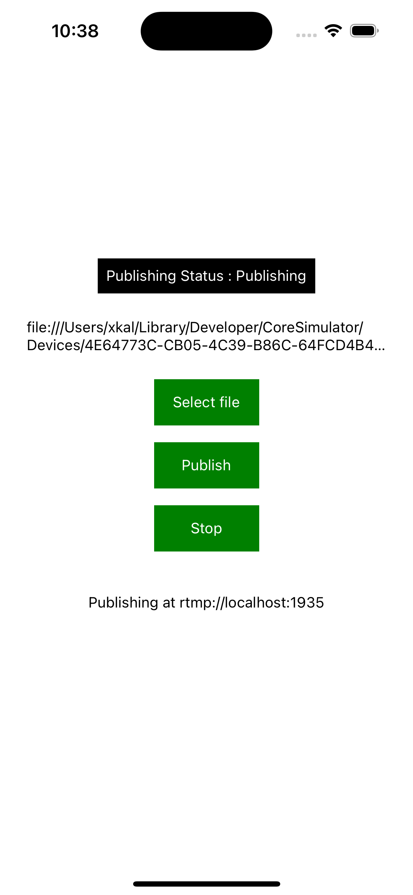
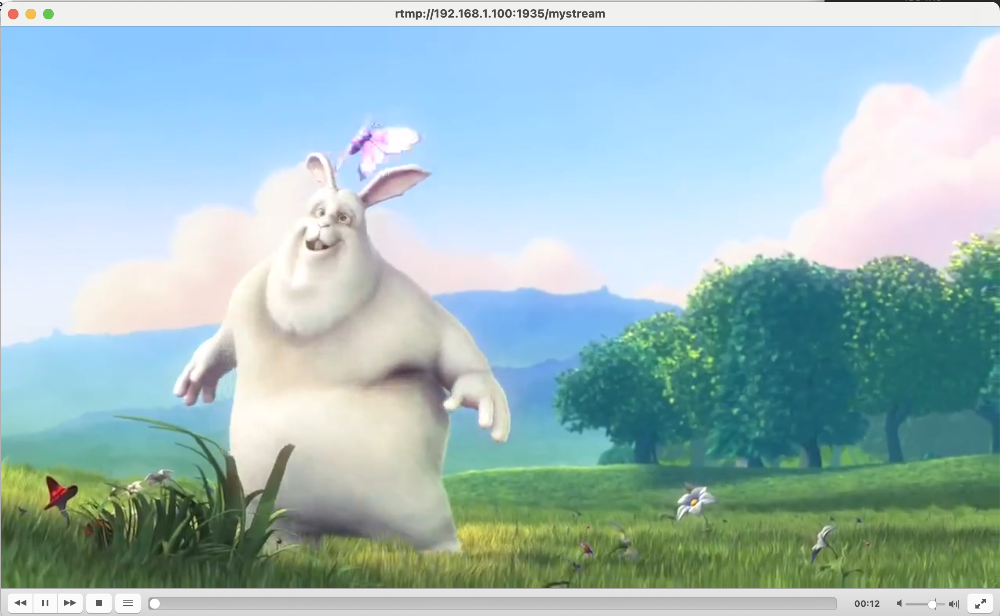

# react-native-live-file-publisher

This is a file publisher to publish the video file to RTSP or RTMP server.

## Features
- Publish video file streams to RTSP or RTMP servers.
- Easy integration into your Flutter applications.

## Installation

```sh
npm install react-native-live-file-publisher
```
or
```sh
yarn add react-native-live-file-publisher
```

## Usage

```typescript
import {
  PublisherProtocol,
  useLiveFilePublisher,
} from 'react-native-live-file-publisher';

// ...

const { publishingState, publish, stop, log } = useLiveFilePublisher({
    url: 'rtmp://192.168.1.100:1935',
    mode: PublisherProtocol.RTMP,
  });

.
.
// publish
/**
timestamp: '00:00:00'
filepath: local file path
name: stream name
**/
try {
    publish(<filepath>, <name>, <timestamp>);
} catch (e) {
    console.log(e);
}
```

### Enums
```typescript
export enum PublisherProtocol {
  RTMP,
  RTSP_UDP,
  RTSP_TCP,
}

export enum PublishingState {
  Normal = 'Normal',
  RequestPublish = 'RequestPublish',
  Publishing = 'Publishing',
  RequestStopPublish = 'RequestStopPublish',
}
```

### Known issues

There are some issues publishing iphone video which are in HEVC format. They need to be transcoded using iOS UIImagePicker compression or other compression techniques. Before publishing to the server, you need to shrink resolution to streaming video resolution (1280x720). By default, the package `expo-image-picker` does it for you. 

### Screenshots

> Publishing with the example app


> Playing in VLC player


## Contributing

See the [contributing guide](CONTRIBUTING.md) to learn how to contribute to the repository and the development workflow.

## License

MIT

---

Made with [create-react-native-library](https://github.com/callstack/react-native-builder-bob)
